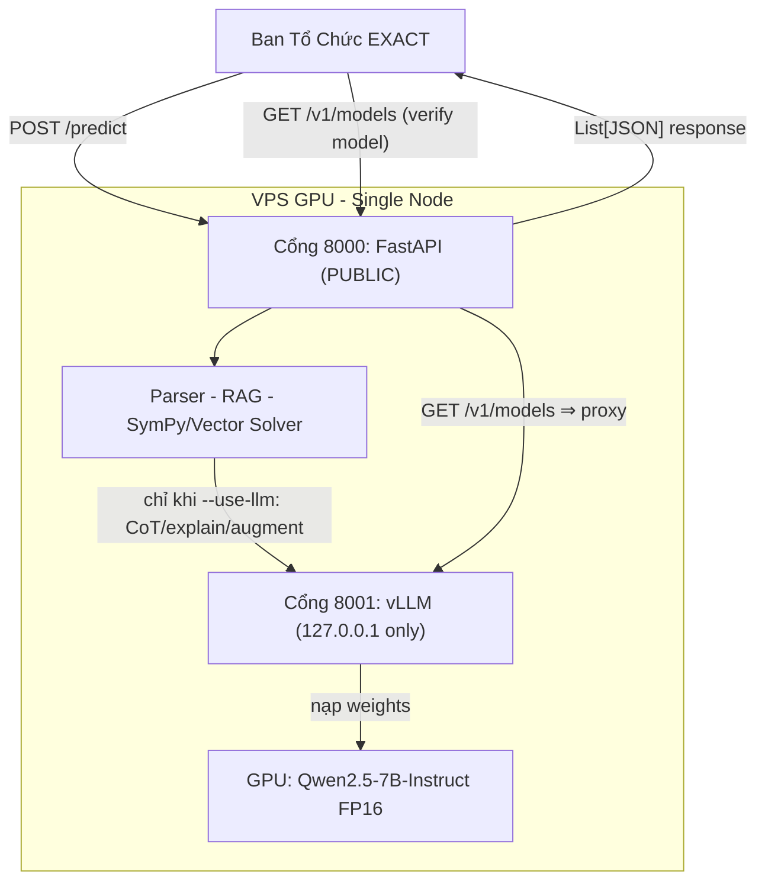

# EXACT 2026 — Deployment Runbook (Production)

> **Tổng hợp** từ `docs/plan10-110626/task3_deployment_setup.md` + `docs/plan10-110626/plan.md` §3, đã chắt lọc + **sửa 2 lỗi chí mạng** + bổ sung các bước thiếu. Đây là tài liệu execution-ready (deadline nộp **12/06/2026**, Public Test Day **15/06**).
>
> Nguồn luật: `docs/official_spec_gaps.md`. Mọi chỗ mâu thuẫn → theo file đó.

---

## 0. TL;DR — 2 lỗi phải fix trước khi deploy

| # | Lỗi trong plan gốc | Hậu quả | Fix |
|---|--------------------|---------|-----|
| **A** | Cô lập vLLM `127.0.0.1`, "chỉ expose `/predict`" | Committee **không query được `/v1/models`** → không verify được model ≤8B → **vi phạm luật / loại** | **Proxy `GET /v1/models` qua FastAPI** (cổng public 8000 forward về vLLM local). Xem §3. |
| **B** | `config.yaml`: `api.port=8000` **và** prod `api_base=localhost:8000` | FastAPI + vLLM đụng cổng 8000 → 1 process chết | Tách cổng: vLLM **8001** (local), FastAPI **8000** (public); `api_base → localhost:8001`. Xem §3. |

> Lỗi A là quan trọng nhất: `urls.txt` nộp kèm BẮT BUỘC liệt kê *predict URL + mọi `/v1/models` URL* (official_spec_gaps §5). Committee dùng `/v1/models` để khớp `model_id` với model khai trong solution.pdf.

---

## 1. Kiến trúc đích (đã sửa)



- **1 cổng public duy nhất: 8000** (FastAPI). Mọi thứ committee cần (`/predict` + `/v1/models`) đi qua đây.
- **vLLM nghe `127.0.0.1:8001`** — không expose trực tiếp. `/v1/models` đến tay committee qua **proxy** trong FastAPI → vừa an toàn (đúng ý plan gốc) vừa verify được model.
- Solver (SymPy/vector) chạy không cần LLM; vLLM chỉ phục vụ `--use-llm` (augment/fallback/explain).

---

## 2. Phần cứng + quy mô

Quy mô: **Single-node GPU**, tối ưu trên 1 máy.

| Hạng mục | Khuyến nghị | Lý do |
|----------|-------------|-------|
| GPU | **1× VRAM ≥ 24GB** (RTX 3090/4090, A5000, A10G, L4) | Qwen2.5-7B FP16 ≈ 15GB weights + 4–6GB KV cache → 24GB an toàn, không OOM. **KHÔNG dùng ≤16GB cho FP16.** |
| CPU/RAM | 8 vCPU / 32GB | chạy song song Python + SymPy + FAISS |
| OS | Ubuntu 22.04 + NVIDIA driver + CUDA | |
| Provider | RunPod / Vast.ai / Lambda / AWS — **thuê GPU VM THÔ** | Tự host hợp lệ. ⚠️ **KHÔNG dùng inference-endpoint của provider** (= 3rd-party API → vi phạm). |

> Độ trễ: vLLM sinh vài giây/câu → thừa ngân sách 60s/câu. Nút thắt là tính toán local, không phải mạng.

---

## 3. Thay đổi code TRƯỚC khi deploy (làm trên repo, commit)

### 3.1. `configs/config.yaml` — chuyển prod + tách cổng

```yaml
llm:
  active: prod                 # ⬅ đổi dev → prod
  ...
  profiles:
    prod:
      api_base: "http://localhost:8001/v1"   # ⬅ vLLM ở 8001 (KHÔNG 8000)
      model_name: "Qwen/Qwen2.5-7B-Instruct" # PHẢI khớp model_id thật ở /v1/models

api:
  host: "0.0.0.0"
  port: 8000                   # FastAPI public — giữ 8000, tách khỏi vLLM 8001
```

### 3.2. `api/main.py` — thêm proxy `GET /v1/models` (FIX A)

```python
import os, httpx

VLLM_BASE = os.getenv("VLLM_BASE", "http://127.0.0.1:8001")

@app.get("/v1/models")
async def proxy_models():
    """Forward model list từ vLLM local để committee verify model ≤8B
    mà không cần expose cổng vLLM ra Internet."""
    async with httpx.AsyncClient(timeout=10) as client:
        r = await client.get(f"{VLLM_BASE}/v1/models")
        return r.json()
```

> `httpx` đã có sẵn (dependency của `openai`). Committee gọi `http://<ip>:8000/v1/models` → FastAPI forward → trả `model_id` thật từ `config.json` của weights.

---

## 4. Runbook trên VPS (thứ tự chạy)

> Khuyến nghị **bare-metal (pip + uvicorn)** cho lần nộp này — nhanh & ít sa lầy hơn Docker (Docker GPU cần thêm `nvidia-container-toolkit`). Docker để sau nếu còn giờ (xem §7).

```bash
# 1. Môi trường
sudo apt update && sudo apt install -y python3-venv git
git clone <repo> && cd EXACT2026-NeuroSymbolic-QA
python3 -m venv .venv && source .venv/bin/activate
pip install -r requirements.txt
pip install vllm                       # Linux + CUDA

# 2. Tải model (~15GB) — LÀM SỚM, tốn băng thông
huggingface-cli download Qwen/Qwen2.5-7B-Instruct --local-dir ~/models/qwen2.5-7b

# 3. Chạy vLLM (nội bộ 8001) — giữ chạy qua tmux/systemd
tmux new -s vllm
vllm serve Qwen/Qwen2.5-7B-Instruct \
  --model ~/models/qwen2.5-7b \
  --host 127.0.0.1 --port 8001 \
  --dtype float16 --gpu-memory-utilization 0.90
# Ctrl-b d để detach. Chờ "Application startup complete" (load vài phút).

# 4. Chạy FastAPI (public 8000) — tmux khác
tmux new -s api
source .venv/bin/activate
uvicorn api.main:app --host 0.0.0.0 --port 8000
# Ctrl-b d

# 5. Mở firewall CHỈ cổng 8000 ra Internet (8001 giữ nội bộ)
sudo ufw allow 8000/tcp
# (RunPod/Vast: mở/expose port 8000 trong dashboard)
```

---

## 5. Verify trước giờ G (từ MÁY NGOÀI, không phải localhost VPS)

```bash
# (a) Health
curl http://<ip>:8000/health
# → {"status":"ok"}

# (b) Model verify (FIX A) — model_id phải khớp solution.pdf
curl http://<ip>:8000/v1/models
# → {"data":[{"id":"Qwen/Qwen2.5-7B-Instruct", ...}]}

# (c) /predict Type 2
curl -X POST http://<ip>:8000/predict -H "Content-Type: application/json" -d '{
  "query_id":"T2_0001","type":"type2",
  "query":"Two resistors 4 ohm and 6 ohm in parallel across 12 V. Find total current.",
  "premises":[],"options":[]
}'
# → [{"query_id":"T2_0001","answer":"5","unit":"A", ...}]
```

Checklist pass: health ok · `/v1/models` trả đúng id · `/predict` trả List JSON đúng schema · latency < 60s · cổng 8001 KHÔNG reachable từ ngoài.

---

## 6. Keep-alive + monitoring (60s/câu, no-retry, slot 1 giờ tuần tự)

- **Server PHẢI ấm + ổn định TRƯỚC slot** — vLLM load vài phút, không kịp nếu khởi động lúc test.
- Giữ chạy: `tmux` (đơn giản) hoặc `systemd` service `Restart=always` (chắc hơn).
- Theo dõi VRAM: `watch -n2 nvidia-smi` — phát hiện OOM sớm. Nếu sát ngưỡng → giảm `--gpu-memory-utilization` hoặc `--max-model-len`.
- Theo dõi log FastAPI (`logging.format: json`) — bắt fallback/timeout.

---

## 7. (Tùy chọn) Docker path — reproducible, làm SAU nếu còn giờ

- `nvidia-container-toolkit` để Docker dùng GPU.
- vLLM có official image; FastAPI 1 `Dockerfile` riêng; nối bằng `docker-compose` (network nội bộ, chỉ map 8000 ra host).
- Lợi: "works on my machine" → giống 100% production. Hại: tốn thời gian dựng → KHÔNG ưu tiên khi T-1 ngày.

---

## 8. Submission artifacts (deploy-adjacent, bắt buộc nộp)

- **`urls.txt`**: `http://<ip>:8000/predict` + `http://<ip>:8000/v1/models` (nhờ proxy, cùng 1 host:port).
- `solution.pdf` (1 trang): model + param ≤8B + datasets.
- `source_code.zip`, `notation_mapping.csv`, Data Disclosure Document.

> ⚠️ **Coordination cần chốt với team:** `plan.md` §2 nói để `notation_mapping.csv` **TRỐNG** (tuyên bố parser đọc canonical LaTeX nguyên bản). Nhưng đã verify `regex_extract` **KHÔNG** đọc được `\frac{}{}` / `\sqrt{}` backslash thuần (chỉ xử lý `×10^`, `^`, `√`, `(a)/(b)` sau sympify-hardening). → Nếu để trống mà BTC gửi `\frac` literal → parse fail. **Phải chọn 1**: (1) ĐIỀN csv (bản `docs/notation_mapping.csv` đã làm) để committee regex-replace về dạng parser nuốt được, HOẶC (2) mở rộng parser đọc LaTeX backslash. Khuyến nghị (1).

---

## 9. Trạng thái phụ thuộc

- ✅ API layer đã rebuild đúng spec (`POST /predict`, List JSON, route bằng `type`, ascii-fy unit inline trong `response_builder.py`).
- 🔲 FIX A (proxy `/v1/models`) + FIX B (config cổng) — **chưa làm**, là điều kiện tiên quyết.
- 🔲 vLLM FP16 trên VPS — chưa dựng.
- 🔲 Type 1 pipeline vẫn mock (`api/main.py` trả "A") — member khác lo; không chặn deploy Type 2.
```
