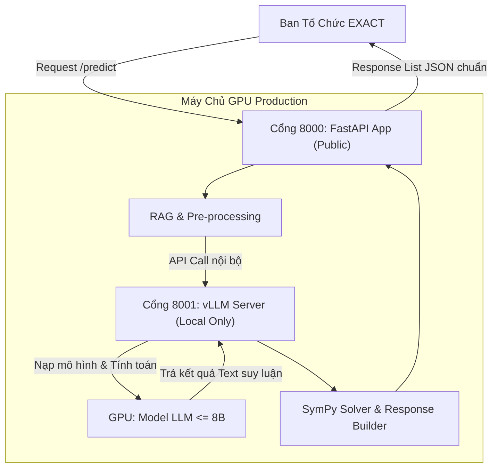

# Kế hoạch công việc 10/06 - 11/06/2026

Tài liệu này tổng hợp các hạng mục công việc cần thực hiện. Chi tiết về tiến độ, log, và checklist đã được phân tách sang các file riêng biệt.

## 1. Xây dựng Script Đánh giá RAG & Classifier
**Tiến độ:** 100% 🟩🟩🟩🟩🟩🟩🟩🟩🟩🟩

Mục tiêu là tạo ra các script đánh giá độc lập (Unit Evaluation) cho 2 "chốt chặn" quan trọng nhất của hệ thống: Formula RAG (tìm công thức) và Physics Classifier (phân loại bài toán).
Việc đánh giá độc lập giúp khoanh vùng lỗi, trả lời câu hỏi: Hệ thống giải sai là do RAG lấy nhầm công thức, Classifier định tuyến sai, hay do LLM/SymPy tính toán sai?

### 🚀 Hướng dẫn chạy thử

**1. Đánh giá Formula RAG:**
```bash
.venv/bin/python scripts/evaluate_rag.py
```
*Kết quả xuất ra: `reports/rag_evaluation.csv`*

**2. Đánh giá Physics Classifier:**
```bash
.venv/bin/python scripts/evaluate_classifier.py
```
*Kết quả xuất ra: `reports/classifier_evaluation.csv`*

---

## 2. Refactor API Layer theo Spec Chính Thức
**Tiến độ:** 100% 🟩🟩🟩🟩🟩🟩🟩🟩🟩🟩

Mục tiêu là cập nhật lại tầng API (endpoint, request/response schema) để đảm bảo khớp 100% với Submission Guide của cuộc thi EXACT 2026.
Công việc bao gồm việc chuyển sang dùng một endpoint chung là `/predict`, đồng bộ cấu trúc object thành format List JSON, thực hiện ASCII-hóa các đơn vị (unit) và trả về đầy đủ luồng `reasoning` / `query_id`.

### 🔧 Chi tiết các thay đổi đã thực hiện:
- **Unified Schema (`api/schemas.py`)**: Hợp nhất `QueryRequest/QueryResponse` thành `UnifiedRequest/UnifiedResponse`. Cấu trúc đầu vào (Data IN) giờ đây bắt buộc có các trường `query_id`, `type`, `query`, `premises`, `options`. Đầu ra (Data OUT) trả về chuẩn List JSON chứa 1 object với `{query_id, answer, unit, explanation, premises_used, reasoning}`.
- **Direct Routing (`api/main.py`)**: Gỡ bỏ hoàn toàn file `router.py` nội bộ. Thay vì "tự đoán" dạng câu hỏi thông qua keyword rất dễ sinh rủi ro, hệ thống giờ đây định tuyến 100% dựa vào field `request.type` (`"type1"` hoặc `"type2"`) do chính server của Ban Tổ Chức (BTC) gửi đến. 
- **Endpoint Update**: Chuyển đổi endpoint từ `/query` sang `/predict`.
- **ASCII-hóa Đơn vị (Unit)**: Viết thêm đoạn xử lý tại pipeline Type 2 để convert tự động các đơn vị Toán học (LaTeX/Unicode) sang chuẩn ASCII mà BTC yêu cầu (VD: `Ω` -> `ohm`, `μF` -> `uF`, `°` -> `degree`).
- **Reasoning Payload**: Đã cấu trúc lại object `reasoning` để nhóm gọn các log suy luận nội bộ (như Chain-of-Thought `cot` hay First-Order Logic `fol`) thay vì để rời rạc bên ngoài. Các trường thừa thãi như `confidence` đã được ẩn khỏi API response và chỉ giữ lại phục vụ theo dõi nội bộ.
- **Notation Mapping**: Tạo sẵn file `notation_mapping.csv` và để trống cấu hình custom. Điều này nhằm gửi tín hiệu với BTC rằng hệ thống Parser hiện tại hoàn toàn tự đọc được bộ ký hiệu toán chuẩn Canonical LaTeX nguyên bản từ bài thi (như `\times`, `\frac`...) mà không cần phía BTC regex_replace trước.

---

## 3. Setup Deployment (Chuẩn bị Server)

Mục tiêu là lên khung và chuẩn bị môi trường chạy chính thức cho project để đánh giá live.
Dựa trên luật thi (cấm sử dụng third-party inference API như Together/Groq), bắt buộc phải thuê/mua VPS/Dedicated server có GPU, cài đặt hệ sinh thái CUDA/Docker, và tự host model qua vLLM Server nội bộ.

### 3.1. Chu trình Deployment (Deployment Cycle) là gì?
Chu trình deployment là quy trình từng bước đưa mã nguồn từ môi trường phát triển (Local Development) lên máy chủ chạy thật (Production Server) để Ban Tổ Chức (BTC) có thể gọi API đánh giá. Với dự án này, chu trình gồm 5 giai đoạn:

1. **Khởi dựng hạ tầng (Provisioning)**:
   - Thuê máy chủ GPU chuyên dụng (như RunPod, Lambda Labs, Vast.ai hoặc AWS).
   - Cài đặt hệ điều hành Ubuntu, NVIDIA GPU Driver, CUDA Toolkit và Docker Engine cùng NVIDIA Container Toolkit (để Docker có thể sử dụng GPU).
2. **Đóng gói ứng dụng (Containerization)**:
   - Tạo file `Dockerfile` đóng gói toàn bộ source code FastAPI, logic RAG, SymPy Solver và các thư viện Python cần thiết.
   - Việc container hóa giúp hệ thống chạy giống nhau 100% trên cả máy local và máy chủ production, tránh lỗi "works on my machine".
3. **Khởi chạy Inference Server (vLLM Engine)**:
   - vLLM được khởi chạy dưới dạng một Docker container độc lập hoặc service nền. Nó tự động tải model từ Hugging Face (hoặc từ ổ đĩa local) lên VRAM của GPU.
   - vLLM đóng vai trò là "động cơ suy luận", expose ra API chuẩn OpenAI trên cổng nội bộ (ví dụ: `8001`).
4. **Khởi chạy Web API (FastAPI application)**:
   - Chạy FastAPI Docker container để tiếp nhận request từ bên ngoài trên cổng public (ví dụ: `8000`).
   - FastAPI nhận bài toán $\rightarrow$ gọi vLLM lấy kết quả CoT $\rightarrow$ đưa qua SymPy solver giải và chuẩn hóa $\rightarrow$ trả response cho BTC.
5. **Kiểm thử & Giám sát (Testing & Monitoring)**:
   - Gửi các request test thử nghiệm để đảm bảo hệ thống phản hồi chính xác dưới 60s.
   - Theo dõi logs và tài nguyên GPU (bộ nhớ VRAM) để phát hiện và xử lý lỗi tràn bộ nhớ (Out-Of-Memory - OOM).

### 3.2. Quy mô hệ thống (Scale) của Dự án EXACT 2026
Do đặc thù cuộc thi và các ràng buộc từ BTC, hệ thống của chúng ta thuộc quy mô **Vừa và Nhỏ (Single-node GPU Server)** nhưng tập trung vào tối ưu hóa hiệu năng tối đa trên 1 node máy chủ.

#### Các ràng buộc quyết định quy mô:
* **Mô hình giới hạn**: Kích thước $\le$ 8B parameters (ví dụ: `Llama-3-8B-Instruct` hoặc `Qwen2.5-7B-Instruct`).
* **Không dùng API ngoài**: Bắt buộc tự host 100%.
* **Độ trễ**: Dưới 60s/request. Tốc độ sinh của vLLM trên GPU hiện đại rất nhanh (khoảng vài giây), nên rào cản chính không nằm ở tốc độ mạng mà ở hiệu năng tính toán local.

#### Cấu hình phần cứng khuyến nghị (Hardware Specs):
* **GPU**: **1x GPU có bộ nhớ VRAM $\ge$ 24GB** (ví dụ: **RTX 3090, RTX 4090, RTX A5000, A10G** hoặc **L4**).
  - *Lý do*: Một mô hình 8B ở dạng nguyên bản (FP16) chiếm khoảng 16GB VRAM khi load vào bộ nhớ. Khi xử lý nhiều request đồng thời và sử dụng context RAG dài, vLLM cần thêm 4-6GB VRAM để chứa bộ đệm KV Cache. Do đó, 24GB VRAM là mức an toàn tuyệt đối giúp hệ thống không bao giờ bị crash OOM.
* **CPU & RAM**: 8 vCPUs và 32GB System RAM là đủ đáp ứng việc chạy song song logic Python, SymPy Solver tính toán ký hiệu và truy vấn vector DB (RAG).

#### Sơ đồ hoạt động và bảo mật (Architecture Diagram):


* **Bảo mật**: Chỉ expose cổng `8000` (FastAPI) ra ngoài Internet cho BTC gọi. Cổng `8001` (vLLM API) được cấu hình chỉ nghe nội bộ (`127.0.0.1`), cô lập hoàn toàn LLM đằng sau FastAPI để đảm bảo an toàn và bảo mật hệ thống.

